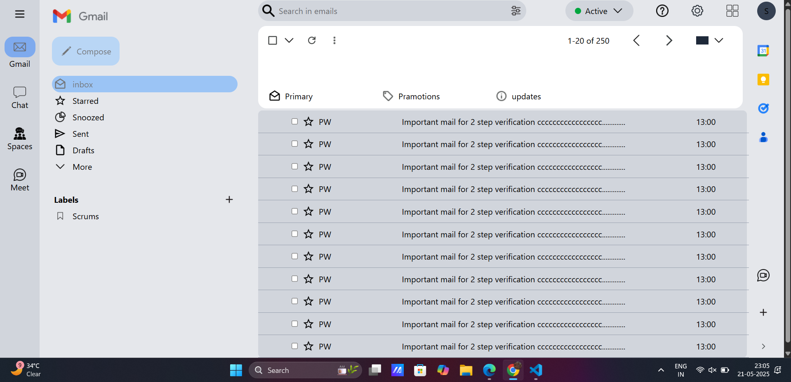

# Gmail UI Clone

A simple Gmail user interface clone built with HTML and Tailwind CSS.

## Screenshots

Below are some example screenshots of the UI.  
*(Make sure you have the images in the `output` folder as shown below)*

### Main UI

## How to Run

1. Clone or download this repository.
2. Open `Gmail-UI-clone.html` in your browser.
